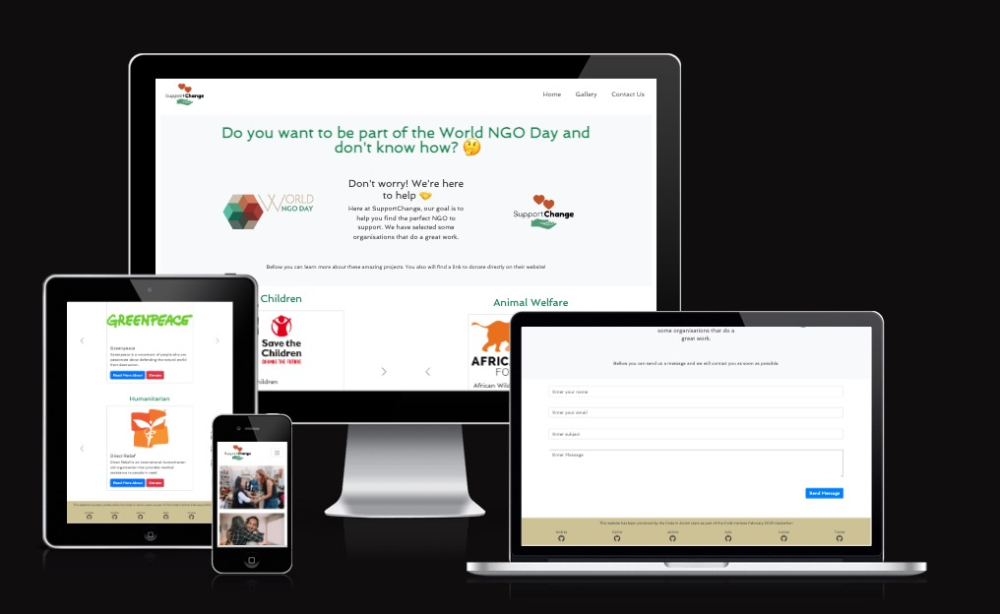
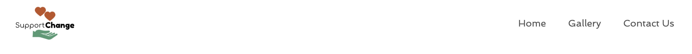

# Support Change
​
## Team Name: Code In Action
​
[Link to Deployed Project](https://ktc96.github.io/hackathon-feb-23)

​
## Contents
​
* [User Experience (UX)](#user-experience)
  * [User Stories](#user-stories)
* [Technology](#technology)
  * [Tech Stack](#tech-stack)
  * [Languages](#languages)
* [Initial MVP Idea](#initial-mvp-idea)
  * [Actual idea & content](#actual-idea--content)
  * [Future Development](#future-development)
* [Design](#design)
  * [Color Scheme](#color-scheme)
  * [Typography](#typography)
  * [Imagery](#imagery)
    * [Logo](#logo)
  * [Wireframes](#wireframes)
* [Deployment & Usage](#deployment)
  * [Remote Deployment](#remote-deployment)
  * [How To Fork](#how-to-fork)
  * [How To Clone](#how-to-clone)
* [Testing](#testing)
* [Credits](#credits)
  * [Content](#content)
  * [Media](#media)
  * [Acknowledgements](#acknowledgements)
​
## User Experience
* Easily navigate website content and pages.
* Contact the company to inquire for more information or to provide sponsorship.
* Access links to NGO websites, sorted into different catagories, allowing the oppurtunity to easily donate and find out more information.

### User stories
* As a user of the Support Change website, I want the ability to learn about NGOs and the work that they carry out. This will allow me to make an informed decision to donate with them. 
  * End user goal: provide a carousel element for different catagories of NGOs. Allowing the user to access links with more infomation as well as a link directly to the donation page. 
  * Acceptance criteria: Allow the user to easily browse through different ngos and navigate to their sites via links. 
* As a user of the Support Change website I want to visualise the impact of donations and voluntary work in different communities. 
  * End user goal: Provide a gallery of images demonstrating the work the NGOs are carrying out. 
  * Acceptance criteria: Have a visually pleasing gallery page for the user to see the potential impact of their donation.
* As a user of the SUpport Change website I want to enter in contact with them.
  * End user goal: Provide a contact form where the user can send us a message.
  * Acceptance criteria: Have a form which will send the user message to a Google Sheets form.
​
## Technology:

### Tech Stack
​

* Google APP Script was used to create the contact form.
* Bootstrap: Boostrap enables building of webpages quickly, which is key in short turnaround project.
* Git
* GitHub
* GitHub Pages

### Languages:

* HTML: HTML was used to create the basic architecture of our website.
* CSS: We used CSS to style our HTML elements, making them more eye catching to improve the user experience.
* JavaScript: We chose JavaScript to generate an eyecatching and well presented website, providing a high quality user experience.

* Tools
  * [Pexels](https://www.pexels.com/): Pexels was used for copyright free images
  * [Favicon](https://favicon.io/): Favicon was used to transform logo into icon
  * [LogoMakr](https://logomakr.com/): LogoMakr was used to create the logo
  * [Coolors](https://coolors.co/): Coolors was used to create the color palette
  * [Google Fonts](https://fonts.google.com/): Google Fonts was used to select the fonts
  * [Font Awesome](https://fontawesome.com/icons): Font Awesome was used to select icons
  * [Figma](https://www.figma.com/): Figma was used to design the wireframes
  * [Am I Responsive](https://ui.dev/amiresponsive): Am I Responsive? was used to test website responsiveness.
  * [tinypng](https://tinypng.com/): tinypng was used to compress file size

​
## Initial MVP Idea:
​
Following the initial team meeting, project ideas were shared and the agreed idea was to work on creating a platform to connect people with existing NGOs and promote the work that they do. 
​
### Actual idea & content:
​
The main aim of the website is to help users find NGOs that they can donate to and or find more info about the organisation.
There is a gallery page to showcase the work of the NGOs and how peoples donations are enabling them to do the work they do.
There is a contact us page where users can contact us.
​
- File structure:
    
    - index.html
    - gallery.html
    - contact.html
    - 404.html (error handling)
    - assets folder >
        - images > 
            - ngos > ngo logo images
            - all copyright free images
        - css
          - style.css file
        - js > 
            - script.js file
            - ngos.js file

### Future Development:

* It would be nice to include database connection where all the messages from Contact Us would be save.
* We would love to create an Events page where users would create local volunteer events. The users could create and search for events on their area.
* Connect to a Map API to display the event location.
​
## Design
​
### Color Scheme:
The colour palette uses colours from the world ngo day logo to represent that the SupportChange website supports NGOs.

- #C05224
- #4D9B74
- #348754 
- #CDC392
- #FFFFFF

​
### Typography:
Rokkitt, Cormorant Garamond and Spinnaker were identified as suitable fonts to be used on the website
​
### Imagery:

[Pexels](https://www.pexels.com/) was used to source copyright free images for the website gallery and [tinypng](https://tinypng.com/) was used to compress file size
​
#### Logo:

[LogoMakr](https://logomakr.com/app/476zty) was used to create the SupportChange logo

### Wireframes:
​
#### Mobile Wireframes:
[Link to Mobile Wireframes](https://www.figma.com/file/raNj2O8G8HP65H6zlMibij/SupportChange?node-id=0%3A1&t=LFn11uRQHsI98C9S-0)

​
#### Desktop Wireframes:
​
[Link to Desktop Wireframes](https://www.figma.com/file/raNj2O8G8HP65H6zlMibij/SupportChange?node-id=16%3A59&t=LFn11uRQHsI98C9S-0)
​
​
​
## Deployment

### Remote Deployment
The site was deployed to GitHub pages. In order to deploy the website, the following steps were taken:

* In the GitHub repository, navigate to the Settings tab
* On the left side menu, on the section Code and automation, click on Pages.
* From the source section drop-down menu, select the Deploy from a branch.
* From the branch section drop-down menu, select main, right on the side select /root.
* Once the the branch menus have been selected, github will create the page. It might take a few minutes. Once it is done a link will show up on the top of the page.
* The live link can be found here: [Support Change](https://github.com/KTC96/hackathon-feb-23)

### How to Fork
To fork the repository:

* Log in (or sign up) to [Github](https://github.com/).
* Go to the repository for this project. [Code In Action - Support Change](https://github.com/KTC96/hackathon-feb-23)
* Click the Fork button in the top right corner.

### How to Clone
To clone the repository:

* Log in (or sign up) to [Github](https://github.com/).
* Go to the repository for this project. [Code In Action - Support Change](https://github.com/KTC96/hackathon-feb-23)
* Click on the code button, select whether you would like to clone with HTTPS, SSH or GitHub CLI and copy the link shown.
* Open the terminal in your code editor and change the current working directory to the location you want to use for the cloned directory.
* Type 'git clone' into the terminal and then paste the link you copied in step 3.
* Press enter.
​
## Testing

* Navbar: All the links on the navbar are working.
  * I clicked on the logo and it took me to the index.html page
  * I clicked on the Home and it took me to the index.html page
  * I clicked on the Gallery and it took me to the gallery.html page
  * I clicked on the Contact Us and it took me to the contact.html page

* Footer: All the links on the footer are working.
  * I clicked on the link of each developer GitHub and it open a new tab with their GitHub page.
  

* Home: All the NGOs cateogries and links are working.
  * I clicked on the carousels navigation arrow and all eight are working.
  * I clicked on the Read More About button and it took me to the NGO's website.
  * I clicked on the Donate button and it took me to the NGO's donate page on their website.

* Gallery: All the images on the Gallery are working. When I hover the mouse on the images, its opacity changes and a description text is showed on the center of the image.

* Contact Us: When I fill up the form and send a message it saves on the [Google Sheets](https://docs.google.com/spreadsheets/d/1k61zMHuYCb3y-qw4eo3G3CBcmMBDaMDuITubdiS4D4M/edit#gid=0) file that keeps all the messages.

* 404: When I try to access a page that does not exist, the 404.html page is showed.

​
## Credits

### Content
All the information about the NGO's were taken from their websites.
​
### Media

* All the NGO's logos were taken from their websites.
* Gallery images were taken from [Pexels](https://www.pexels.com/)
* World NGO Day logo was taken from their [website](https://worldngoday.org/).
​
### Acknowledgements
Thanks to the Code Institute's hackteam for another amazing hackathon.

This project was developed by: 

[Andres](https://github.com/andresfgc)

[Carlos](https://github.com/felipesandoli)

[Kyle](https://github.com/KTC96)

[Louise](https://github.com/Louibens)

[Tanise](https://github.com/tanisecarvalho)

